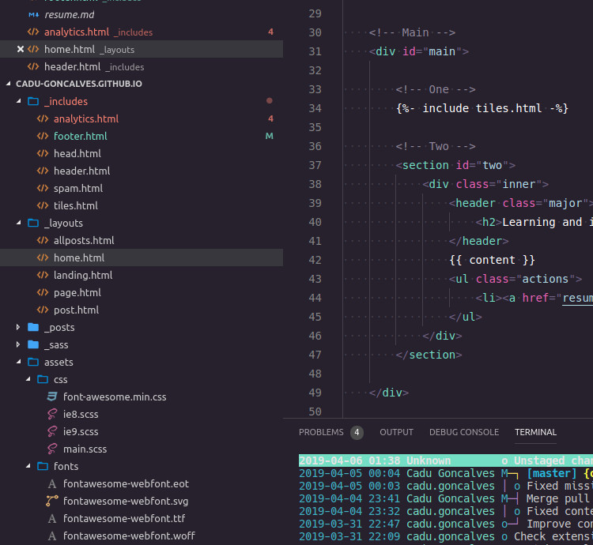
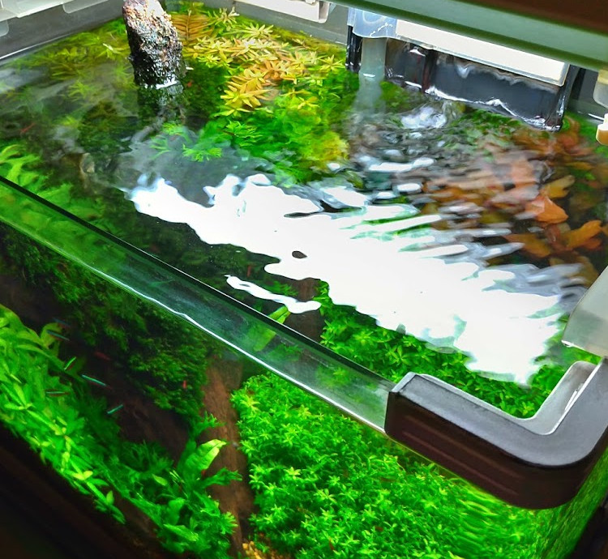

<!-- Main -->

<!-- One -->
<section id="one">
	

		<header class="major">
			<h2>Versatility</h2>
		</header>
		
I've multiple interests, most of them related with technology because I've been dealing with projects and hands-on stuff since I was 16 years old. Here you can find what I do for living and for fun.

	

</section>

<!-- Two -->
<section id="two" class="spotlights">
	<section>
		
		

			

				<header class="major">
					<h3>Software development</h3>
				</header>
				
I’ve been working with software development since 2002, dealing with different business domains. <b>Full Stack Developer</b>, <b>Back End Developer</b> and <b>Software Architect</b> are usually my professional positions. 

				<ul class="actions">
					<li><a href="resume.html" class="button">More</a></li>
				</ul>
			

		

	</section>
	<section>
		
		

			

				<header class="major">
					<h3>Aquascaping</h3>
				</header>
				
I really like the contact with the nature so I like to spend part of my time dealing with aquariums and aquascaping. Belive me keeping small planted tanks requires a lot of knowledg and sensibility and is really fun and challeging. I also like to build part of the technical equipement required to keep the tanks working properly. 

				<ul class="actions">
					<li><a href="resume.html" class="button">More</a></li>
				</ul>
			

		

	</section>
	<section>
		
		

			

				<header class="major">
					<h3>Electronics and IOT</h3>
				</header>
				
I started my live as engiener  at high school learning <b>Electronics</b>, so part of my memories are activated when I'm cutting wires and welding some components. Nowadays I try to keep some IOT projects for myself and I also have some projects that I'll share as open source in the near future.

				<ul class="actions">
					<li><a href="resume.html" class="button">More</a></li>
				</ul>
			

		

	</section>
</section>

<!-- Three -->
<section id="three">
	

		<header class="major">
			<h2>Learning and improving</h2>
		</header>
		
I try to learn and improve as much as I can, here you can find links so some of my projects and achivements.

		<ul class="actions">
			<li><a href="resume.html" class="button next">Check it out</a></li>
		</ul>
	

</section>

