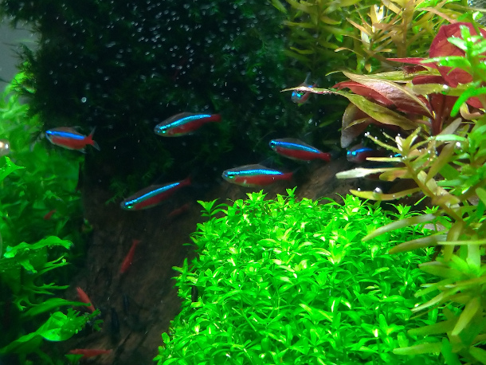
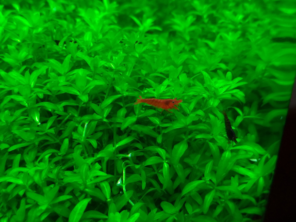

  
  Aquarism was the hobby I chose with almost 30 years old, unlike many aquarists. A hobby that requires dedication and attention to details attracted me a lot, especially planted aquariums, in which the objective is to harmonize the needs of fish and plants and produce submerged landscapes. It is a hobby that allows us to keep in touch with nature, value all natural resources and understand about time and patience.

  
  I keep some ornamental fish and shrimp in my aquarium and I like to dedicate a few hours a week to keep everything running smoothly. I like to build part of the equipment I use in my aquariums, including filters, equipment for CO2 injection (necessary for the development of plants) and more recently automation and control systems, basically <b> Internet of Things </b> where the "things" are the equipment connected to the aquarium.

