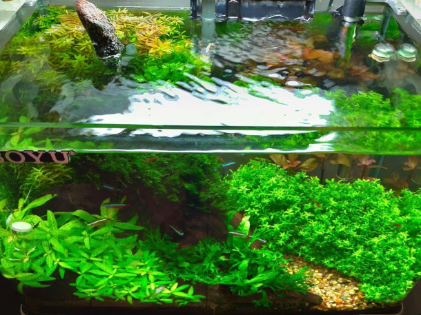
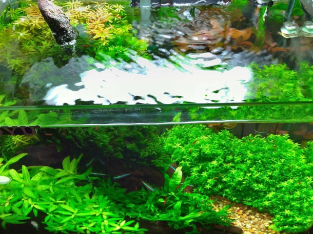
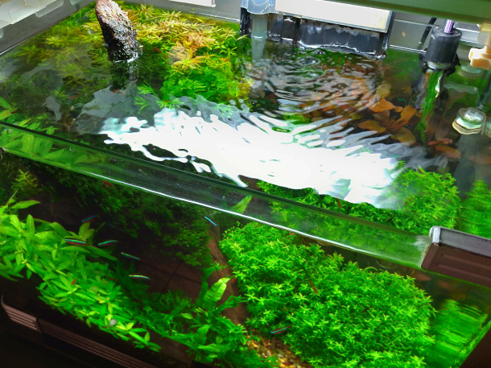
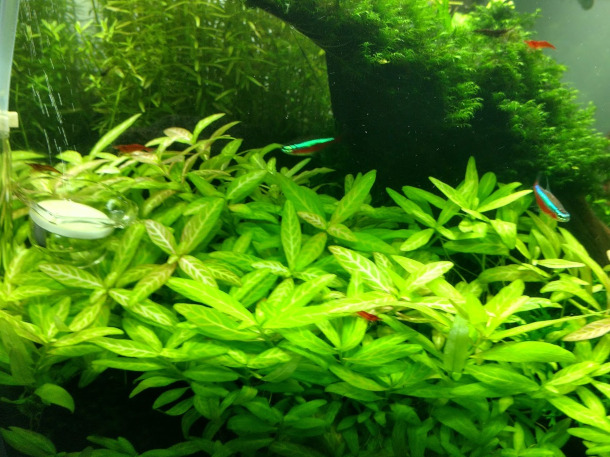
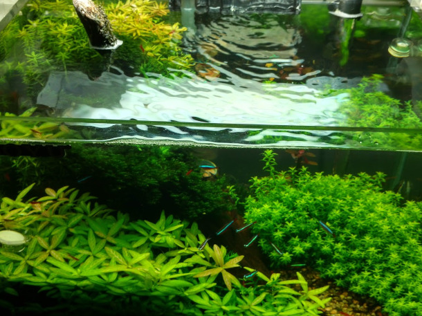
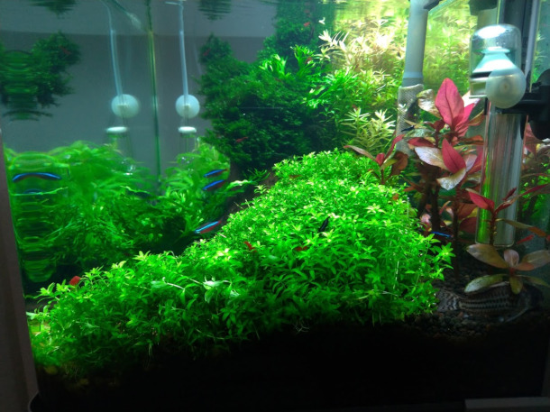
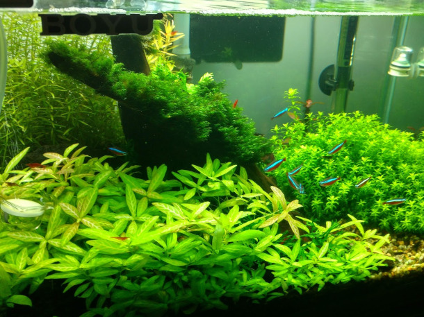
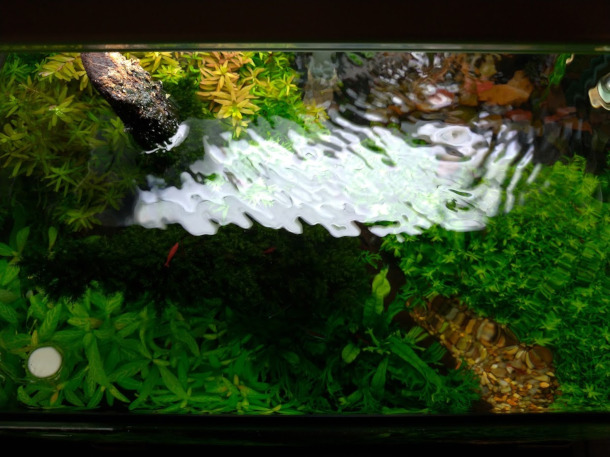
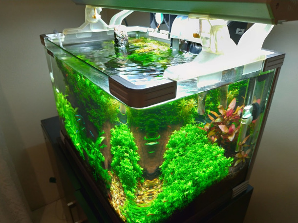

<!-- Main -->

<!-- One -->
<section id="one">
	

		<header class="major">
			<h2>Software Development</h2>
		</header>
		 

			<ul class="alt">
				<li>Dolor etiam magna etiam.</li>
				<li>Sagittis lorem eleifend.</li>
				<li>Felis feugiat viverra.</li>
			</ul>
		 

	

</section>

<!-- Two -->
<section id="two">
	

		<header class="major">
			<h2>Aquascaping</h2>
		</header>
		

			

				

				

				

				<!-- Break -->
				

				

				

				<!-- Break -->
				

				

				

			

		

</section>

<!-- Three -->
<section id="three">
	

		<header class="major">
			<h2>Electronics and IOT</h2>
		</header>
		

		

	

</section>

